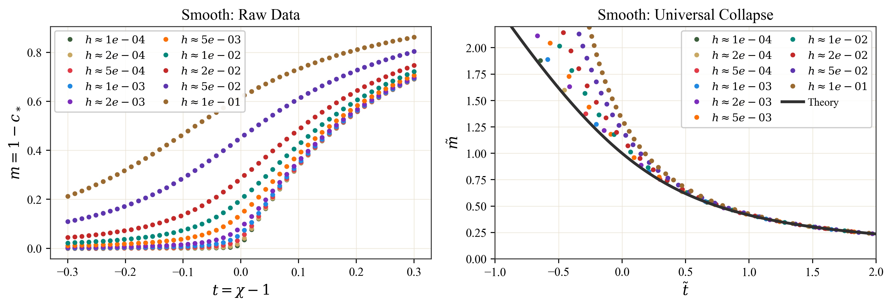

# Dropout Universality Experiments

Code and saved runs for **Dropout Universality: Scaling Laws and Optimal Scheduling at the Edge-of-Chaos**.

Paper: [arXiv:2605.21648](https://arxiv.org/abs/2605.21648)

<p align="center">
  
</p>

This repository packages the mean-field theory utilities, experiment notebooks, saved results, and figure-generation scripts behind the ICML 2026 paper. The main practical result is that front-loaded dropout schedules improve held-out loss at fixed dropout budget, predicted by the correlation-length theory and checked in MLP and Vision Transformer experiments.

## Repository Layout

```text
src/dropout_mft/     Shared schedules, result loading, plotting, and style helpers
scripts/             Figure-generation entry points
results/             Portable saved runs for all paper figures (.npz and .json)
figures/paper/       Paper-quality PDF figures, plus the README headline PNG
notebooks/           Experiment reruns and ablations
pyproject.toml       Editable package metadata
```

Saved MLP and sweep results use a JSON-manifest-plus-NPZ-array format, so figure reproduction does not require unsafe pickle loading.

## Setup

Use Python 3.11.

```bash
python -m venv .venv && source .venv/bin/activate
pip install -e .
```

or with conda/mamba:

```bash
mamba env create -f environment.yml
conda activate dropout-universality-experiments
pip install -e . --no-deps
```

The editable install makes `dropout_mft` importable from scripts and notebooks without modifying `sys.path`.

For notebook hygiene and tests before committing:

```bash
pip install -r requirements-dev.txt
pre-commit install
pytest
```

The tests cover the schedules, the scalar solvers, and a round trip through the
pickle-free results format.

## Reproduce Figures

Remake all main paper figures from the saved runs:

```bash
python scripts/make_figures.py --all
```

Generate the Appendix B.4 regularization-reach figure:

```bash
python scripts/make_regularization_reach_figure.py
```

The scripts write both PDF and PNG files locally. The repo tracks PDFs for paper-quality output and keeps only the README headline PNG under version control.

## Notebook Map

| Notebook | Main output |
| --- | --- |
| `notebooks/mean_field/meanfield_dropout_criticality.ipynb` | Critical exponents, scaling collapses, Hermite diagnostics |
| `notebooks/mlp/mlp_dropout_scheduling_overfit.ipynb` | MLP schedule comparison curves |
| `notebooks/mlp/mlp_dropout_budget_controls.ipynb` | Fixed-budget schedule controls |
| `notebooks/sweeps/relu_h_sweep.ipynb` | ReLU mean-dropout sweep |
| `notebooks/sweeps/relu_width_sweep.ipynb` | ReLU width sweep |
| `notebooks/sweeps/gelu_h_sweep.ipynb` | GELU mean-dropout sweep |
| `notebooks/transformer/vit_cifar100_dropout_scheduling.ipynb` | ViT CIFAR-100 schedule curves |
| `notebooks/transformer/vit_component_ablation.ipynb` | Transformer component ablations |

## Citation

```bibtex
@misc{sarmiento2026dropoutuniversality,
  title={Dropout Universality: Scaling Laws and Optimal Scheduling at the Edge-of-Chaos},
  author={Lucas Fernandez Sarmiento},
  year={2026},
  eprint={2605.21648},
  archivePrefix={arXiv},
  primaryClass={cs.LG},
  url={https://arxiv.org/abs/2605.21648}
}
```

## License

MIT
